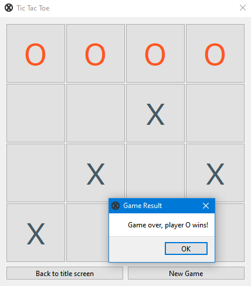

Implementation du jeu TIC TAC TOE avec Qt de c++
### Conception & Design
Les modèles de conception utilisés dans ce projet.

#### MVC
MVC est l'abréviation de Model View Controller, l'idée principale sous-jacente est la séparation des préoccupations, au lieu d'avoir une vue et un modèle fortement couplés et dépendants, la vue ne concerne que la mise à jour des éléments de l'interface utilisateur et ne sait rien du modèle et vice versa.
<br>
Cela encourage également la réutilisation car le modèle ou la vue peut être facilement remplacé ou réutilisé dans un autre projet.<br>
Le jeu Tic Tac Toe utilise cette conception en définissant les trois composants principaux.

- **Modèle**: 'board'.
- **Affichage**:  ' TicTacToeGame '.
- **Controleur**: ' TTTController '.

### Objet Null
No Agent est une classe qui définit un comportement d'un agent Null, elle évite d'utiliser une instruction conditionnelle pour vérifier si un agent existe ou non, et utilise simplement le polymorphisme pour appeler l'agent, s'il est défini comme inexistant par les options du jeu, alors cette classe vide ne fera rien.

Le code :
```
// Cette vérification est effectuée à chaque appel de jeu.
if(AiIsChosen)
  AiAgent->play();
```
devient :
```
// Si le NoAgent est spécifié, rien ne se passera.
AiAgent->play();
```

#### Modèle d'observateur
Tout projet Qt utilisera très certainement ce modèle de conception, car c'est l'idée principale derrière le mécanisme principal de Qt, le Signal et le systéme Slot.


## Le test

- Classe ' Board '
  - Accès invalide aux cellules.
  - Accès valide aux cellules.
  - Évaluer aucun gagnant.
  - Évaluer les victoires de O.
  - Évaluer les victoires de X.
  - Évaluer l'égalité.
  - Réinitialisation de la carte.
- Agent MinMax
  - Le joueur est le premier joueur et l'IA est à un coup de gagner.
  - L'IA est le premier joueur, et l'IA est à un coup de gagner.
  - Le joueur est le premier joueur et l'IA empêche le joueur de gagner.
  - L'IA est le premier joueur et l'IA empêche le joueur de gagner.

## Les technologies utilisées
- Qt 6.0.2
- Qt Creator 5.13
- QMake version 6.1
- GCC version 8.3.0


## Captures d'écrans


